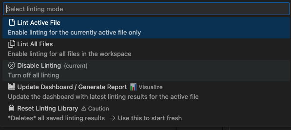

# Ludwig VS

**Ludwig VS** is a Visual Studio Code linter designed to help developers write accessible HTML and JSX. Ludwig ensures compliance with WCAG and WAI-ARIA AA standards by providing real-time linting, error annotations, and recommendations for improving code accessibility. Additionally, it offers a dashboard that visualizes the number of accessibility errors and warnings over time, allowing developers to track progress and save historical data.

One sixth of the world’s population will experience a disability at some point in their lifetime, yet 98% of websites contain accessibility issues, making them challenging for individuals with disabilities to use. Ludwig directly addresses this problem by integrating into the development process, rather than relying solely on post-development accessibility testing. It annotates HTML and JSX accessibility errors in real-time, such as missing ARIA attributes or inaccessible interactive elements via keyboard. The Ludwig dashboard provides a real-time overview of code errors and offers detailed information to help developers enhance their web content’s accessibility.

Ludwig tests HTML and JSX against over 100 critical accessibility guidelines outlined by WAI-ARIA. We plan to expand Ludwig’s capabilities to cover all guidelines and provide more robust data visualizations. If you or someone you know would like to contribute to Ludwig, please contact us!

Visit the [Ludwig](https://www.ludwigvs.com) website to learn more.

# Set-Up

Download Ludwig VS from the VS Code extensions marketplace.

To start Ludwig, navigate to the document that you want scanned and click on "Ludwig: Disabled" on the bottom status bar to enable it. This should pop up a drop down menu from the command palette with these options:

Errors and warnings found in current active editor will be reported in the 'Problems' tab in the bottom panel, in addition to highlighting the line where the error was found. 

**In order to populate Dashboard with historical scan results:**
1. Open HTML/JSX Document where you want to scan for accessibility issues.
2. Select "Lint Active Files" to save scan results in local JSON library.
3. Continue editing the file as needed.
4. Select "Update Dashboard/Generate Report" to see new changes reflected on progression chart. 

**Note:**  
- If there are no changes between updates to the dashboard, no new plots will appear on the chart.   
- Each file has its own separate local JSON library, located in the Summary_Library folder created when "Lint Active File" is triggered. This library stores the linting data for that specific file.

# Deep Dive
**Powered by ESlint:**
Ludwig utilizes the JSX a11y ESLint plugin to parse through the user's codebase and extract accessibility errors/warnings using a custom formatter. [JSX A11Y](https://github.com/jsx-eslint/eslint-plugin-jsx-a11y#readme)

**Logic behind Accessibility Score:**
Referenced Google Lighthouse's accessibility severity weighting to implement the scoring system.
The table below shows the corresponding weights to each accessibility warning/error.

|    JSX Rules    | Custom Severity | Weighted Score |
|-----------------|-----------------|----------------|
| Critical Errors |

# User Best Practices

Please note that Ludwig is currently in Beta and functions best when used with proper HTML and JSX formatting. Therefore, to ensure proper formatting, please use a well-established linting tool such as [Prettier](https://marketplace.visualstudio.com/items?itemName=esbenp.prettier-vscode).

# Open Source Work

| Feature / Bug                                                 | Status      |
| --------------------------------------------------            | ----------- |
| Create further dashboard tools for data visulizations         | In progress |
| Prioritize errors and warnings based on custom severity score | To-Do       |
| Integrate AI tools to help automate error fixing              | To-Do       |
   
# Contributors
Version 2.0 Team:  
Anar Gasimov | [LinkedIn](https://www.linkedin.com/in/anargasimov/)  
Benson Cheng | [LinkedIn](https://www.linkedin.com/in/bensonhpcheng/)  
Kristian Schott | [LinkedIn](https://www.linkedin.com/in/kristian-schott/)  
Saagar Mehta | [LinkedIn](https://www.linkedin.com/in/saagar-mehta-a86981110/)  
Spencer Hezzelwood | [LinkedIn](https://www.linkedin.com/in/spencer-lane-hezzelwood-650b9a19/)  

Version 1.0 Team:  
Connie Johnson | [LinkedIn](https://www.linkedin.com/in/connie-johnson-7a33152a4)  
Harold Reeves | [LinkedIn](https://www.linkedin.com/in/haroldreeves/)  
Jake Johnson | [LinkedIn](https://www.linkedin.com/in/jake527/)  
Prashay Mehta | [LinkedIn](https://www.linkedin.com/in/prashaymehta/)  
Tyler Spicer | [LinkedIn](https://www.linkedin.com/in/tyler-e-spicer/)  

# Licensing Info

MIT License

Copyright (c) 2023 OSLabs Beta

Permission is hereby granted, free of charge, to any person obtaining a copy
of this software and associated documentation files (the "Software"), to deal
in the Software without restriction, including without limitation the rights
to use, copy, modify, merge, publish, distribute, sublicense, and/or sell
copies of the Software, and to permit persons to whom the Software is
furnished to do so, subject to the following conditions:

The above copyright notice and this permission notice shall be included in all
copies or substantial portions of the Software.

THE SOFTWARE IS PROVIDED "AS IS", WITHOUT WARRANTY OF ANY KIND, EXPRESS OR
IMPLIED, INCLUDING BUT NOT LIMITED TO THE WARRANTIES OF MERCHANTABILITY,
FITNESS FOR A PARTICULAR PURPOSE AND NONINFRINGEMENT. IN NO EVENT SHALL THE
AUTHORS OR COPYRIGHT HOLDERS BE LIABLE FOR ANY CLAIM, DAMAGES OR OTHER
LIABILITY, WHETHER IN AN ACTION OF CONTRACT, TORT OR OTHERWISE, ARISING FROM,
OUT OF OR IN CONNECTION WITH THE SOFTWARE OR THE USE OR OTHER DEALINGS IN THE
SOFTWARE.